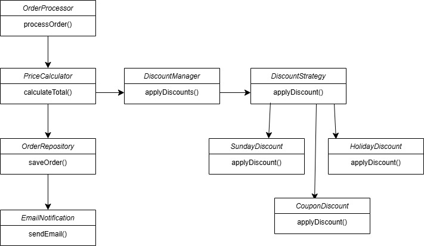

# SOLID Principles

The **SOLID** principles are a set of five design principles in object-oriented programming that help developers create more maintainable, scalable, and flexible software. These principles were introduced by **Robert C. Martin (Uncle Bob)** and aim to improve code readability, reusability, and testability.

## 2. Open/Closed Principle (OCP)
### **1. Identify the Existing Problem**

Right now, if discount calculations are embedded directly inside `PriceCalculator` or `OrderProcessor`, we must modify the core logic every time we introduce a new discount (e.g., Buy-One-Get-One-Free, Holiday Discounts). This approach:

-   Makes the system harder to maintain.
-   Increases the risk of breaking existing functionality.
-   Violates OCP because the class isn't closed for modification.

### **2. Design an Extensible Solution**

We can introduce a **strategy-based discount system**, where each discount type is handled separately, and `PriceCalculator` only interacts with a `DiscountManager` that applies the relevant discounts.

Here’s how we can refactor the system:

1.  **OrderProcessor remains unchanged** and delegates pricing work to `PriceCalculator`.
2.  **PriceCalculator only calculates the base price** and doesn't handle discounts directly.
3.  **DiscountManager takes charge of applying discounts** by calling different `DiscountStrategy` implementations.
4.  **Each discount type (e.g., Holiday Discount, Coupon Discount) becomes a separate class** implementing a common `DiscountStrategy` interface.
5.  **New discounts can be added without modifying existing logic**, keeping the system flexible and future-proof.

### **3. Explanation of the New Design**

-   We **don’t modify** `PriceCalculator` when adding new discounts—**we just create a new discount class**.
-   The system is **easier to maintain and scale**, since each discount type is separate.
-   We follow **OCP** by making the system **open for new discount types but closed for modification**.

With this approach, **new promotional discounts can be added effortlessly without changing core pricing logic**, making our system **future-proof and scalable**
