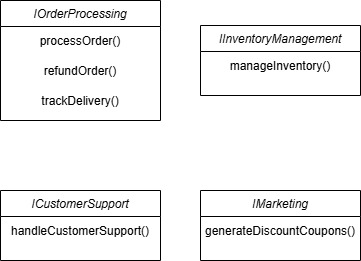

# SOLID Principles

The **SOLID** principles are a set of five design principles in object-oriented programming that help developers create more maintainable, scalable, and flexible software. These principles were introduced by **Robert C. Martin (Uncle Bob)** and aim to improve code readability, reusability, and testability.

## 4. Interface Segregation Principle (ISP)

### **1. Identifying Unnecessary Methods**

Currently, the `IMerchantServices` interface has too many responsibilities, violating the **Interface Segregation Principle (ISP)**. Different roles in the system need only a subset of these methods.

For example:

-   **InventoryManager** only needs: `manageInventory()`. It **does not** require `processOrder()`, `refundOrder()`, or `handleCustomerSupport()`.
-   **CustomerSupportRep** only needs: `handleCustomerSupport()` and possibly `trackDelivery()`. It **should not** have methods like `manageInventory()` or `generateDiscountCoupons()`.
-   **MarketingManager** only needs: `generateDiscountCoupons()`. It **does not** handle orders, inventory, or customer support.

### **2. Propose Segmented Interfaces**

Break down the large interface into **smaller, more specific** interfaces.

   

### **3. Brief Write-Up**

By splitting `IMerchantServices` into **smaller interfaces**, we achieve: 
 
**1. Better Maintainability** – Developers only implement the necessary methods, reducing unnecessary dependencies.  
**2. Improved Flexibility** – If new roles (e.g., `LogisticsManager`) are introduced, they only implement the required interface instead of an oversized one.  
**3. Easier Testing & Debugging** – Smaller interfaces lead to **more modular code**, making debugging and testing more manageable.

This segmentation ensures that **each class is only responsible for what it actually does**, making the system **cleaner, more scalable, and ISP-compliant**!
