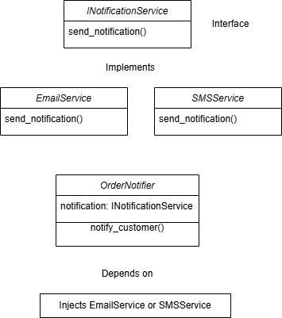

# SOLID Principles

The **SOLID** principles are a set of five design principles in object-oriented programming that help developers create more maintainable, scalable, and flexible software. These principles were introduced by **Robert C. Martin (Uncle Bob)** and aim to improve code readability, reusability, and testability.

## 5. Dependency Inversion Principle (DIP)

### **1. Understanding the Problem**

The `OrderNotifier` class currently depends directly on `EmailService`, meaning it **cannot send notifications via any other method** without modifying its code. This violates the **Dependency Inversion Principle (DIP)** because `OrderNotifier` is tightly coupled to a **specific** low-level module (`EmailService`). If we want to add `SMSService` later, we would need to **modify OrderNotifier**.

### **2. Designing an Abstraction**
We can create an **abstraction** (`INotificationService`) that defines a general `send_notification()` method. Both `EmailService` and `SMSService` will **implement** this interface, allowing `OrderNotifier` to depend on **an abstraction instead of a concrete class**.

#### **Refactored Design**

1.  **Create an Interface (`INotificationService`)**
    
    -   Defines a method `send_notification()` for all notification services.
2.  **Implement Concrete Classes**
    
    -   `EmailService` and `SMSService` both implement `INotificationService`.
3.  **Modify `OrderNotifier` to Depend on `INotificationService`**
    
    -   Instead of directly instantiating `EmailService`, `OrderNotifier` receives `INotificationService` via **dependency injection**.
 
### **3. Injection Strategy**

To inject the correct notification service, we can use:

-   **Constructor Injection** (Recommended) – Inject `INotificationService` into `OrderNotifier` when creating an instance.
-   **Setter Injection** – Set `INotificationService` dynamically at runtime.
-   **Factory Pattern** – Use a factory method to create the appropriate notification service dynamically.

### **4. Justification**

This design **adheres to DIP** by ensuring that `OrderNotifier` depends on an **abstraction (`INotificationService`)**, not a concrete class (`EmailService`). It allows **seamless extension**—if we want to add `PushNotificationService` later, we simply implement `INotificationService` without modifying `OrderNotifier`. This improves **flexibility, maintainability, and testability**, as we can easily **mock** `INotificationService` in unit tests. The system is now **loosely coupled**, making it more scalable and adaptable to future changes.
